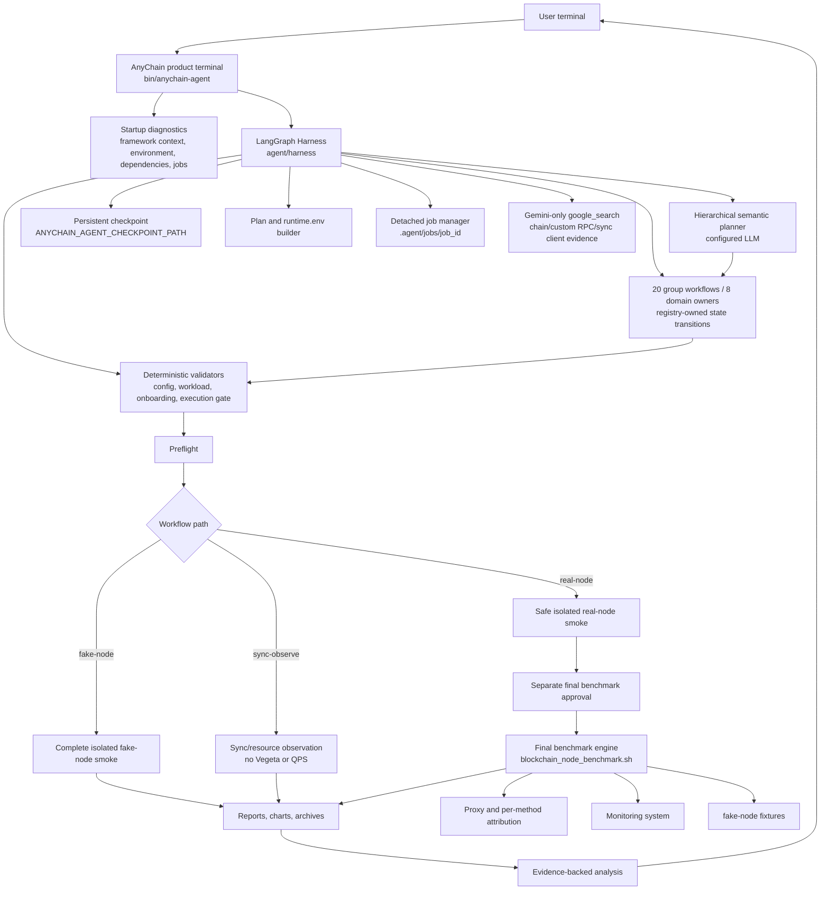
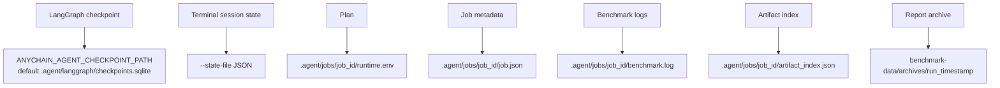

# AnyChain Agent Architecture

The filename is retained as a stable documentation link. It does not mean ADK
owns the Agent runtime.

AnyChain Agent is a LangGraph Harness-based product agent that controls the
blockchain-node-benchmark engine. The Harness owns workflow state, group
routing, fallback ordering, validation gates, and execution decisions. Every
model provider implements the same `LLMProvider` contract. OpenAI, DeepSeek,
and Vertex Gemini use OpenAI-compatible transports; Gemini API-key mode uses
native `generateContent`, Claude API-key mode uses the Anthropic Messages API,
and Vertex Claude uses `rawPredict`. Google ADK is used for exactly one optional
capability, Gemini `google_search` grounding
(`agent/llm/search_grounding.py`), called as a plain function from Harness
code. It must never own a second benchmark wizard, a second conversation
loop, or mutate workflow state outside the Harness.

## Dependency Topology

The runtime has two dependency tiers:

- core: `langgraph`, `langgraph-checkpoint-sqlite`, `openai`, and
  `prompt-toolkit`; this tier runs the terminal and every configured provider,
  including DeepSeek, without importing `google.adk`;
- optional search extra: `google-adk`, installed only with
  `scripts/install_agent_deps.sh --with-google-search`, for the scoped Gemini
  `google_search` function.

`requirements-adk.txt`, `.venv-adk`, and `--adk-venv` are migration aliases,
not statements that ADK owns the runtime. The preferred venv option is
`--agent-venv`. Missing Google ADK disables only web research; it must not block
CLI startup, provider authentication, planning, validation, or execution.

## Architecture Overview



## Agent Loop

```mermaid
flowchart LR
  A["prepare"] --> B["adjudicate"]
  B --> C{"input authority"}
  C -- "exact declared option / Y-N / trusted command or transport" --> X["trusted local contract admission"]
  C -- "manual value / semantic or structured input" --> P["partition"]
  P --> O["compile_owner<br/>one scheduled owner"]
  O -- "owners remain" --> O
  O -- "all owners checkpointed" --> R["review_plan<br/>independent semantic admission"]
  R --> D["admit<br/>deterministic validation"]
  X --> E
  D --> E
  C -- "empty / no-op" --> L["fallback"]
  E["select one action"] --> F["route one owner"]
  F --> G["commit typed result"]
  G --> H{"side effect?"}
  H -- "yes" --> I["persist intent"]
  I --> J["invoke idempotently"]
  J --> K["commit receipt"]
  H -- "no" --> L["next action / fallback"]
  K --> L
  L --> M["compose one response"]
  M --> N["validate and checkpoint"]
```



This is one checkpointer-backed compiled graph. There is no secondary
uncheckpointed turn graph and no post-hoc queue-draining loop. Each graph
transition selects at most one admitted `ActionEnvelope`; every owner returns
a typed `HandlerResult`, and only the commit boundary may mutate durable
domain state. External work is authorized by a persisted `SideEffectIntent`
and completed by a `SideEffectReceipt`. Every turn records a `TurnReceipt`
that binds semantic units, admitted actions, execution order, unresolved
units, and the resulting question.

The deterministic fast path is deliberately narrow. It accepts only an exact
option id/value/label/number declared by the active question, including
declared Y/N choices, exact terminal commands, evidence-transport framing, and
empty input. A manually entered typed value is not an exact option: it enters
semantic partitioning so the model can assign ownership, after which the
pending-question contract and owning domain still perform deterministic value
validation.

`partition`, every individual `compile_owner`, and `review_plan` are separate
checkpointed transitions. `review_plan` performs independent whole-plan
semantic admission over the immutable owner documents. The following `admit`
node is a different trust boundary: it deterministically validates action
schema, provenance, conflicts, prerequisites, pending-question contracts, and
queue eligibility before actions become durable.

A plan containing a registered semantic value with a non-read-only effect
uses a two-review rule. Two independent admission requests must both admit the
same immutable plan; either semantic rejection or malformed review fails the
complete transaction closed. A Harness-minted consensus receipt binds the
plan, transaction, ordered action identities, both review hashes, and request
sizes to every durable envelope. Read-only plans continue to use one review.

When exact DemandAtoms remain unresolved, `review_plan` may create a durable
but non-executable `SemanticPlanDraft`. Its locally validated candidates are
evidence, not admitted actions: they cannot enter benchmark configuration,
group readiness, or `action_queue`. The coordinator asks one revision-bound
atom question at a time. After the final resolution it restores the original
pending contract and active group, recompiles the complete original source
with the resolution evidence, and reruns coverage, whole-plan review, and
deterministic admission. Every newly admitted envelope carries the same
finalization receipt. Session, schema, registry, pending-contract, or workflow
precondition drift invalidates the draft; reset/cancel never commits its
candidates. External execution requires a later fresh authorization turn and
cannot be finalized from a draft.

The persisted semantic-partition receipt names its `planning_lane` as either
`bounded_semantic_value` or `hierarchical`. The producer, runtime-event
validator, retained-regression verifier, and audit export share this strict
schema; an absent or unknown lane fails closed.

One bounded scalar lane is intentionally narrower than the general
whole-plan path. When a pending option/manual value or a registered semantic
value has an exact source anchor, `bounded_semantic_lane.py` may request one
model mapping into the finite candidate catalog. Its immutable receipt binds
the question/registry/catalog, source clause and units, candidate identity,
provider/model, prompt and response hashes, and deterministic checks. The
verified receipt projects directly into normal deterministic admission; it
does not pass through a second whole-plan model reviewer. Ambiguous prose,
missing anchors, competing identities, or an out-of-catalog value returns to
the general hierarchical path.

## Product Head And Terminal Delivery

LangGraph checkpoints are physical execution storage, not the authority for
which turn the user has accepted. `turn_transactions.py` owns one logical
Product Head and creates an isolated physical checkpoint thread for each turn
attempt. A successful attempt atomically advances the Product Head and writes
one immutable terminal outbox result. Cancellation, timeout, and provider or
runtime failure leave the Product Head unchanged. An uncertain external effect
creates a reconciliation barrier; no new attempt may start until an immutable
operator resolution is recorded.

Invariant recovery commits a typed recovery state on the original physical
attempt. It cannot leave one aborted result and then create a second committed
result for the same accepted input. On restart, active attempts are closed
from typed side-effect evidence and undelivered outbox results are replayed
from their exact checkpoint and render hash.

Every provider call uses one completion executor under the turn's absolute
deadline and one bounded retry budget. A side-effect-free request may retry a
transport failure or a normal text completion with empty text. Abnormal finish
reasons, refusals, safety outcomes, tool calls, and alternate structured
outputs fail closed even when partial text is present. The turn-scoped
collector is the sole provider-attempt evidence authority: a successful turn
stores its bounded, secret-free sequence with the committed Product Head
checkpoint; a failed turn stores the same sequence in an immutable physical
attempt checkpoint and binds that checkpoint to the terminal diagnostic.
Provider failure, timeout, and cancellation never advance Product Head.

The shared deadline permits bounded concurrency only for work whose inputs are
already frozen and independent: owner compilations and fixed open-identity,
Stage-B, and whole-plan jury members. Workers use separate copied runtime
contexts but share the same absolute deadline, cancellation event, and locked
provider-attempt collector. Their outputs and per-owner control receipts are
merged in canonical submission order. A first worker failure cancels and joins
all siblings before the typed failure escapes, so no background task or second
state authority survives the turn. Stage-A proposal/convergence, per-reviewer
contract repair, and component calls outside an active runtime turn remain
serial.

`terminal_protocol.py` defines the shared non-secret terminal projection used
by the product and live acceptance runners. Delivery order is:

```text
commit SQLite outbox
-> render and flush the complete terminal frame
-> append and fsync the typed projection
-> acknowledge the outbox row as delivered
```

Projection failure leaves the row undelivered and replayable. Runtime event
schema version 6 and terminal outcome projection schema version 3 bind the
same Product Head authority, transaction ID, terminal event ID, complete
base/attempt/product checkpoint lineage, render hash, publication receipt, and
originating repository revision. The projection contains hashes and control
identities only; it cannot contain user/model text, endpoints, configuration
values, checkpoint payloads, or raw diagnostics. Live runners join the PTY
frame, terminal projection, and runtime event by these typed identities and
never infer outcome from localized prose, question IDs, or option positions.
The join is read-only: production and test runners cannot mutate a runtime
event after observing the expected terminal outcome. Injected test evidence
must use separate runtime-event and terminal-projection producers; both sides
pass through the same production validators before the join.

Deterministic shell commands, bounded `follow` streams, and typed termination
use terminal detour projection schema version 3. A detour carries the explicit
Product Head authority, complete unchanged before/after head, input and stream
hashes, typed stop reason, and the durable runtime-event publication fence
observed when it began. It never creates a workflow attempt or synthetic
runtime event. The SQLite turn-transaction ledger is schema version 15. The
explicit v12-to-v13 migration assigns stable runtime-event identities to
older pending committed outcomes; v13-to-v14 retains the complete canonical
legacy-detour record in the audit quarantine; v14-to-v15 allows an aborted
provider turn to bind its immutable physical-attempt diagnostic checkpoint
without advancing Product Head. Current reads and migration use the same
semantic validator for the exact historical v10/v12 field set,
quarantine-row identity, typed termination, response and rolling-stream
hashes, Product Head lineage, runtime fence, lifecycle status, and
reconciliation provenance. Terminal projections independently reject unknown
effect classes, unprojectable effect statuses, invalid attempt checkpoint
identifiers, and incomplete checkpoint/fingerprint pairs. Partial,
identity-mismatched, or correctly hashed but semantically invalid audit
records fail closed. A v10 ledger
containing committed history
fails closed because it has no authoritative revision ordering. Every legacy
detour that lacks a runtime-event fence is retained in the audit quarantine
and removed from live replay, including completed but undelivered detours.
Current reads reject incomplete lineage.

Startup identity is also a typed production protocol. One session event binds
the process instance, logical session and purpose, provider/model, complete
startup presentation hash, replayed terminal projections, and repository
revision. Qualifying runners reject stale, duplicated, cross-session, or
presentation-mismatched startup evidence. Runtime event schema v6 uses
`turn_committed` as its single event type and records `startup_snapshot`,
`turn_recovered`, `workflow_reset`, or another specific purpose in
`observation`. A committed outcome cannot be presented until its runtime
observation exists; restart recovery reconstructs a missing observation from
the exact committed checkpoints even when an older delivery acknowledgement
already exists. Linux file locking serializes the terminal projection
read-check-append boundary across processes. If the runtime-event JSONL
contains any pre-v6 record, publication receipts for that authority are first
requeued, then the whole incompatible log is atomically moved to a
content-hashed quarantine path. Current v6 records are reconstructed from
exact checkpoints in contiguous Product Head revision order; legacy bytes are
never relabeled as current evidence. Every runtime projection path has a
durable single-authority marker, and default paths include an authority hash,
so one session or purpose cannot remove another authority's observations.

Live acceptance resolves provider/model through the same persistent Agent
configuration loader as the CLI, then freezes that exact identity into the
child PTY environment. Runner-specific environment values are copied into an
immutable snapshot; identity keys are reserved and reapplied last. The child
may source only the repository's canonical private configuration to obtain
credentials; the configuration loader restores an explicitly frozen
provider/model after that source. It cannot use a private override or mutate
an environment mapping to silently select another model. Both missing identity
and expected/observed identity mismatch fail before any evidence can qualify.

Startup session schema version 3 requires a ready session to name a committed
Product Head at revision one or later and the complete runtime-event
publication fence at that same revision. Revision-zero sessions cannot be
advertised as ready. Both the interactive CLI and one-shot prompt entrypoint
close the LangGraph runtime and its SQLite resources on every exit path.
Blocked startup sessions use the terminal protocol's closed
`StartupFailureCategory` enum. Producers, builders, and raw-record validators
share that enum; unknown categories fail closed.

Control-plane responsibilities are deliberately separate:

- `admission.py` validates proposals, conflicts, prerequisites, and semantic
  coverage before an action becomes durable;
- `coordinator.py` is the sole product semantic-routing authority. It chooses
  exact deterministic handling, finite-catalog bounded semantic mapping, or
  the general hierarchical planner without creating another commit path;
- `hierarchical_planner.py` is the sole general semantic planner. Stage A
  partitions the complete turn and assigns bounded owner/group routes; Stage B
  compiles actions with owner-scoped schemas before whole-plan admission;
- `semantic_admission.py` prepares and validates immutable semantic documents
  after owner-scoped compilation. It has no planner entry and does not select a
  provider; the checkpointed `review_plan` transition supplies the configured
  provider for bounded whole-plan semantic review;
- `bounded_semantic_lane.py` owns finite-catalog, source-anchored semantic
  mapping and its immutable evidence receipt; it has no general intent-routing
  or state-mutation authority and cannot bypass whole-plan admission;
- `turn_transactions.py` owns the logical Product Head, isolated physical
  attempts, reconciliation, and terminal outbox;
- `terminal_protocol.py` owns the versioned non-secret terminal projection
  schema and durable JSONL append contract;
- `advisory.py` owns model-backed chain identity, RPC-schema extraction, and
  evidence analysis that cannot mutate state or choose a graph transition;
- `queue.py` owns dependency-safe ordering and pending-barrier eligibility;
- `routing.py` owns navigation prerequisites, return policy, and canonical
  fallback;
- `response.py` is the only terminal-response assembler and
  `visible_response` writer and emits at most one actionable blocking question.
  Domains and the coordinator emit only registered semantic fragments;
  `response_catalog.py` and `response_messages/` are the sole localized
  product-prose authority;
- `coordinator.py` implements graph-node transitions and the sole typed commit
  boundary; it does not interpret natural language, parse terminal input, or
  own domain business rules.

The metadata authority is `agent/workflows/group_registry.py::GROUPS`. It
defines the 20 groups, their fields, questions, dependencies, invalidations,
and owner. `agent/harness/state.py::DEFAULT_GROUP_ORDER` and
`agent/harness/domains/registry.py` are derived runtime views. They are not
additional authorities.

The graph additionally routes typed control actions through a `coordinator`
owner. It owns no `GroupSpec` and does not increase the domain-owner count:
there remain 20 groups with exactly eight domain owners.

| Order | Group | Owner |
|---:|---|---|
| 1 | `opening` | `orientation` |
| 2 | `target_mode` | `chain_rpc` |
| 3 | `chain_identity` | `chain_rpc` |
| 4 | `provider_deployment` | `environment` |
| 5 | `ledger_disk` | `environment` |
| 6 | `accounts_disk` | `environment` |
| 7 | `network` | `environment` |
| 8 | `endpoint_process` | `chain_rpc` |
| 9 | `chain_auxiliary_endpoints` | `chain_rpc` |
| 10 | `workload_rpc` | `chain_rpc` |
| 11 | `target_samples_fixtures` | `chain_rpc` |
| 12 | `qps_profile` | `performance` |
| 13 | `sync_observe` | `sync_observe` |
| 14 | `observability` | `performance` |
| 15 | `advanced_tuning` | `performance` |
| 16 | `preflight_smoke_execution` | `execution` |
| 17 | `job_monitoring` | `execution` |
| 18 | `failure_recovery` | `recovery` |
| 19 | `error_evidence_analysis` | `analysis` |
| 20 | `report_artifact_analysis` | `analysis` |

Exactly eight domain owners serve these groups. The loop prevents the Agent
from acting like a keyword bot:

- user intent is interpreted by the configured model and returned as typed graph actions;
- confirmed facts are stored as structured LangGraph state;
- users may jump between groups, go back, or revise prior answers;
- completing an interrupted group falls back to the next missing required group;
- every execution path passes through deterministic validators;
- the Agent asks for missing information instead of inventing values;
- smoke tests are isolated from final benchmark job artifacts;
- real-node benchmark jobs require preflight, isolated smoke success, and a
  separate final approval; repeated approvals are idempotent;
- side-effecting execution is typed by the authoritative
  `agent/runners/execution_scenarios.py` registry. An operation/workflow
  mismatch fails closed; the runtime never rewrites a requested operation
  based on plan contents;
- analysis must cite generated evidence paths.

## Accuracy Boundaries

The Agent may infer and suggest values, but it must not silently decide:

- `LEDGER_DEVICE` when multiple disks are plausible;
- whether a separate `ACCOUNTS_DEVICE` exists;
- custom RPC parameter contracts;
- mixed workload weights;
- unsupported chain adapter family;
- real-node endpoint validity before preflight;
- external Prometheus/Grafana scraping behavior.

When uncertain, the Agent must show the available evidence and ask the user to
confirm or provide a value.

## Runtime State And Artifacts



`runtime.env` is the final per-job confirmed configuration. Users should not
edit it manually. If a user changes an earlier answer, the Harness must update
or invalidate the affected group state and regenerate downstream runtime
artifacts through deterministic tools.

Checkpoint state uses schema version 23. Current-version turns never invoke a
legacy action compiler. Version 12 checkpoints cross the explicit migration
boundary; version 13 checkpoints additionally migrate deferred-queue retention
into the typed pending-question contract; version 14 initializes typed response
fragments before persistence as version 15; version 16 materializes the
explicit pending-question owner and typed Chain/RPC case context; and version
17 introduces the checkpointed `semantic_planning` contract; version 18
retires persisted turn-local response text and manifests in favor of the
current response authority; and version 19 introduces coordinator-owned
`SemanticPlanDraft` state. Migration to version 19 discards incompatible
in-flight planning, drafts, draft-bound questions, and response scratch rather
than resuming a contract compiled under an older schema, while retaining
compatible durable workflow state. Version 20 binds draft creation and
finalization to the real Product Head checkpoint lineage plus the current
group, action, and question authorities. Version 19 drafts are invalidated
during migration because they cannot prove those bindings. A version 20 draft
that outlives any contract-authority change is marked stale before current
registry validation and cannot enter admission. Version 21 adds atom-level
semantic evidence, opaque secret references, signed question scheduling
fields, and atomic finalization receipts; incomplete version 20 finalization
transactions are quarantined as a whole. Version 22 adds a durable-state
secret-binding registry. Version 23 signs sensitivity into the group/question
contract, uses salted memory-hard secret verifiers, and transacts registry
mutations with the Product Head commit. Checkpoints and durable execution plans
retain only opaque references and verifiers. Exact sensitive scalar answers
are projected before the LLM and first checkpoint. In compound turns,
deterministic typed candidates such as endpoint URLs and structured
credentials are projected separately, preserving sibling demands for semantic
planning; declared numbered/Y-N options are not treated as secret material.
Raw material exists only at the job-local invocation boundary; job directories
use mode `0700` and
secret-capable files use mode `0600`. Runtime cleanup uses a cached ownership
index and remains observable and retryable. Missing current-version material
installs an exact signed question-contract-v6 re-entry contract. Version 21
state containing raw credentials or references, and version 22 state containing
old bindings or references, is quarantined rather than resumed.
Older checkpoints are quarantined: only an allowlisted set of environment
facts is exposed for reconfirmation, and old pending actions or guessed plan
files are never resumed as executable work.

## Google Search Boundary

ADK `google_search` is intentionally narrow:

- enabled only for an eligible Gemini configuration with valid Gemini/Google
  authentication and an ADK runtime that
  exposes the tool (`agent/llm/search_grounding.py::web_research_status`);
- invoked only as a scoped, single-query function call
  (`run_google_search_grounding`) from the chain-identity, custom-RPC schema,
  and sync-observe client-setup domain paths — never a persistent Agent/Runner
  or a second conversation loop;
- used for unknown-chain/protocol, custom RPC, and node-client research;
- official documentation is preferred;
- search evidence does not replace endpoint tests, fixture recording, template
  validation, or fake-node smoke.

Other model providers must report web research as unavailable unless the
repository explicitly adds and verifies a provider-specific search integration.

## Custom-RPC Contract

Custom RPC onboarding preserves wire facts and confirms semantics separately.
Zero-parameter methods use an explicit empty params value. Positional and
object params retain their original list order or object keys; each parameter
must separately confirm index/name, JSON wire type, blockchain semantic type or
encoding, meaning, required/optional status, and example. Request and response
samples are evidence, not substitutes for a reachable endpoint probe.

`single_replace` selects exactly one validated custom method.
`mixed_replace` uses only validated custom methods, while `mixed_add` retains
the template defaults and appends them. Every active mixed method has a positive
integer weight and the exact total is 100. These changes are job-local runtime
overrides; the canonical chain template remains immutable. fake-node execution
also requires authentic method fixtures and coverage, while real-node execution
still requires its final `LOCAL_RPC_URL`.

## Historical-Issue Hygiene

The retired dated repair plan and known-issues register are not architecture
sources. `tests/agent_live/legacy_issue_map.py` maps their still-relevant items
to the current 20 groups, owners, tests, and dispositions. Missing, stale,
manual-only, or behaviorally different evidence remains `open`.

## Sync-Observe Boundary

`sync-observe` is a first-class workflow for node sync/resource observation. It
does not belong to the RPC workload path. When the user asks to watch node
catch-up speed, MGas/s, node process CPU/thread hotspots, disk latency/iowait,
or network behavior without sending benchmark RPC load, the Harness should
route to the sync-observe workflow.

The workflow confirms:

- chain and sync-health/reference behavior;
- resource metadata, including disk and network baselines;
- node process identity for CPU/thread attribution;
- optional `NODE_PROMETHEUS_METRICS_URL` for MGas/s or client-native execution
  metrics;
- stop condition: until stopped, fixed duration, or until synced.

It must not ask for RPC mode, custom RPC workload, mixed weights, Vegeta, or
QPS profile unless the user explicitly switches to an RPC benchmark.

Product execution evidence is counted by scenario, not only by the visible
approval action. The required real scenarios are isolated RPC real-node smoke,
final RPC real-node benchmark, bounded sync-observe, and an independent
fake-node smoke that proves the fixture/tool/report loop. These four jobs use
three distinct approved plans; fake-node evidence cannot alias real-node
evidence. A bounded sync-observe proof must contain observed performance/sync
CSV rows, both localized HTML reports, and the sync timeline chart; it must not
contain Vegeta or proxy workload artifacts.

## Development Gates

Before changing Agent code, read:

1. `AI_CODING_GUIDE.md`
2. `AGENTS.md`
3. `docs/en/anychain-agent-ai-work-gate.md`
4. `agent/README.md`

Then run relevant checks:

```bash
python3 -m unittest \
  tests.test_agent_product_terminal \
  tests.test_agent_runtime_contract \
  tests.test_agent_langgraph_harness \
  tests.test_agent_harness_architecture \
  tests.test_agent_response_authority
python3 tools/check_agent_boundaries.py --root .
git diff --check
```

For model-facing behavior, run the current product Harness defined by the
reviewed task/design document. Lower-level live/PTY scripts can be provider
drivers or developer helpers, but product readiness requires realistic CLI
scenarios and deterministic assertions.

`tests/agent_live/run_product_acceptance.py` is the Phase 8
evidence-admission controller, not the user simulator or real-execution
provider. It generates revision-bound obligation catalogs and admits evidence
produced by subordinate providers. Phase 8 is implemented, but G3-G6 remain
open until retained real-CLI regressions, response-driven dual-AI Chaos, all
required real executions, and the final product review have independently
produced qualifying evidence.

The fixed CLI matrix is not sufficient for product acceptance. Follow
`tests/agent_live/README.md`: DeepSeek runs the real Docker/Linux CLI and Codex
chooses each next user turn from the actual previous response. Generated
schedules, rows, tuples, returned PTY text, and host-only runs are not executed
coverage. A passing item requires revision-bound observed state transitions and
verified postconditions; execution edges additionally require hashed job
artifacts. Registry edge coverage, high-risk multi-edge sequences, executed
covering rows, real execution artifacts, and the required new no-S1/S2 dynamic
rounds must report `observed-pass`, `observed-fail`, `not-run`, and
`externally-blocked` denominators.
fake-node proves only its closed loop, not real-node or sync-observe workflow
coverage. Live Gemini `google_search` remains an explicit external verification
boundary when credentials are unavailable.
