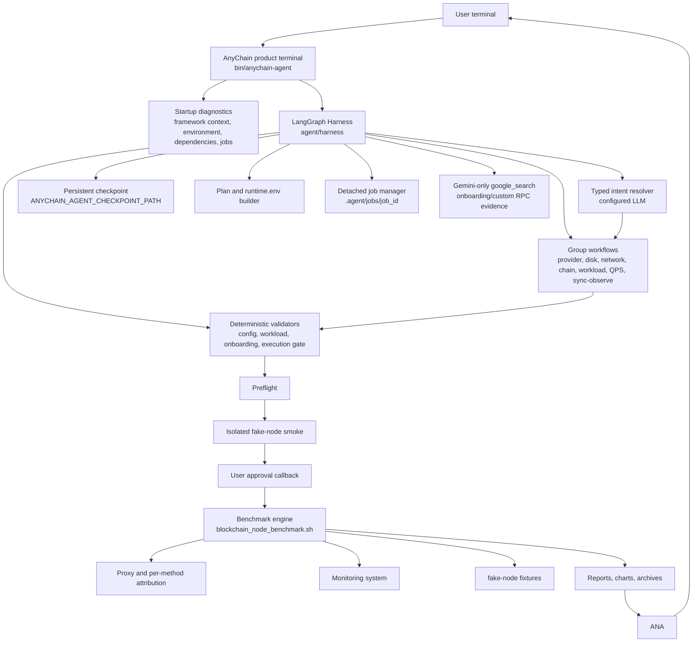
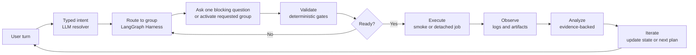
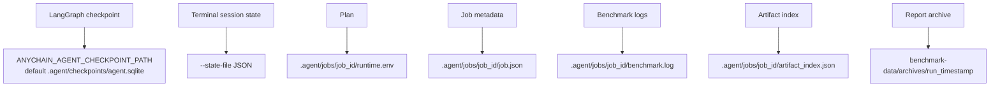

# AnyChain Agent Architecture

AnyChain Agent is a LangGraph Harness-based product agent that controls the
blockchain-node-benchmark engine. The Harness owns workflow state, group
routing, fallback ordering, validation gates, and execution decisions. The
Harness's own model calls are plain OpenAI-compatible HTTP requests for every
provider (OpenAI, DeepSeek, and Gemini on Vertex alike); Google ADK is used
for exactly one optional capability, Gemini `google_search` grounding
(`agent/llm/search_grounding.py`), called as a plain function from Harness
code. It must never own a second benchmark wizard, a second conversation
loop, or mutate workflow state outside the Harness.

## Architecture Overview



## Agent Loop



The loop prevents the Agent from acting like a keyword bot:

- user intent is interpreted by the configured model and returned as typed graph actions;
- confirmed facts are stored as structured LangGraph state;
- users may jump between groups, go back, or revise prior answers;
- completing an interrupted group falls back to the next missing required group;
- every execution path passes through deterministic validators;
- the Agent asks for missing information instead of inventing values;
- smoke tests are isolated from final benchmark job artifacts;
- real benchmark jobs require preflight, smoke, and user approval;
- analysis must cite generated evidence paths.

## Accuracy Boundaries

The Agent may infer and suggest values, but it must not silently decide:

- `LEDGER_DEVICE` when multiple disks are plausible;
- whether a separate `ACCOUNTS_DEVICE` exists;
- custom RPC parameter contracts;
- mixed workload weights;
- unsupported chain adapter family;
- real-node endpoint validity before preflight;
- external Prometheus/Grafana scraping behavior.

When uncertain, the Agent must show the available evidence and ask the user to
confirm or provide a value.

## Runtime State And Artifacts



`runtime.env` is the final per-job confirmed configuration. Users should not
edit it manually. If a user changes an earlier answer, the Harness must update
or invalidate the affected group state and regenerate downstream runtime
artifacts through deterministic tools.

## Google Search Boundary

ADK `google_search` is intentionally narrow:

- enabled only for Gemini with Google authentication and an ADK runtime that
  exposes the tool (`agent/llm/search_grounding.py::web_research_status`);
- invoked only as a scoped, single-query function call
  (`run_google_search_grounding`) from specific Harness call sites (currently
  real-node client setup) — never a persistent Agent/Runner or a second
  conversation loop;
- used for unsupported chain and custom RPC research;
- official documentation is preferred;
- search evidence does not replace endpoint tests, fixture recording, template
  validation, or fake-node smoke.

Other model providers must report web research as unavailable unless the
repository explicitly adds and verifies a provider-specific search integration.

## Sync-Observe Boundary

`sync-observe` is a first-class workflow for node sync/resource observation. It
does not belong to the RPC workload path. When the user asks to watch node
catch-up speed, MGas/s, node process CPU/thread hotspots, disk latency/iowait,
or network behavior without sending benchmark RPC load, the Harness should
route to the sync-observe workflow.

The workflow confirms:

- chain and sync-health/reference behavior;
- resource metadata, including disk and network baselines;
- node process identity for CPU/thread attribution;
- optional `NODE_PROMETHEUS_METRICS_URL` for MGas/s or client-native execution
  metrics;
- stop condition: until stopped, fixed duration, or until synced.

It must not ask for RPC mode, custom RPC workload, mixed weights, Vegeta, or
QPS profile unless the user explicitly switches to an RPC benchmark.

## Development Gates

Before changing Agent code, read:

1. `AI_CODING_GUIDE.md`
2. `docs/en/anychain-agent-ai-work-gate.md`
3. `agent/README.md`

Then run relevant checks:

```bash
python3 -m unittest tests.test_agent_product_terminal tests.test_agent_runtime_contract tests.test_agent_langgraph_harness
python3 tools/check_agent_boundaries.py --root .
git diff --check
```

For model-facing behavior, run the current product Harness defined by the
reviewed task/design document. Lower-level live/PTY scripts can be provider
drivers or developer helpers, but product readiness requires realistic CLI
scenarios and deterministic assertions.
