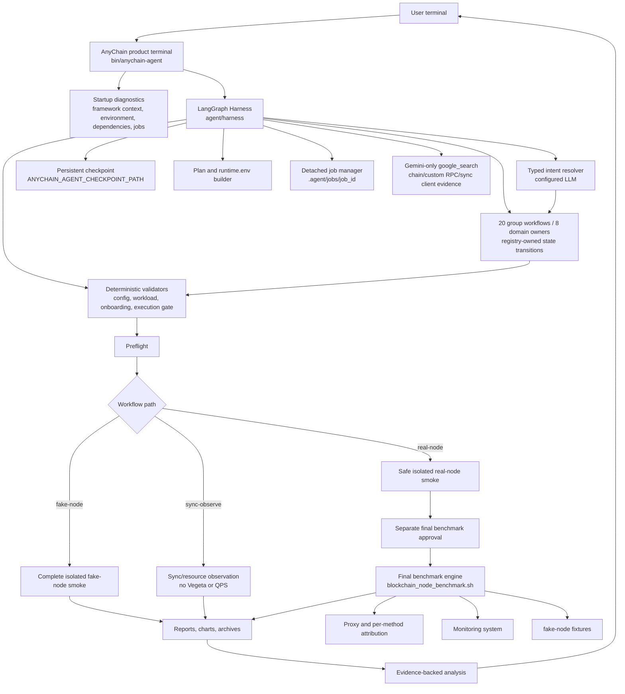
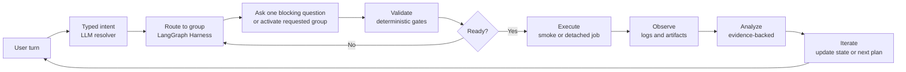
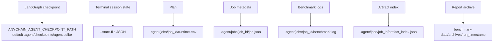

# AnyChain Agent Architecture

The filename is retained as a stable documentation link. It does not mean ADK
owns the Agent runtime.

AnyChain Agent is a LangGraph Harness-based product agent that controls the
blockchain-node-benchmark engine. The Harness owns workflow state, group
routing, fallback ordering, validation gates, and execution decisions. The
Harness's own model calls are plain OpenAI-compatible HTTP requests for every
provider (OpenAI, DeepSeek, and Gemini on Vertex alike); Google ADK is used
for exactly one optional capability, Gemini `google_search` grounding
(`agent/llm/search_grounding.py`), called as a plain function from Harness
code. It must never own a second benchmark wizard, a second conversation
loop, or mutate workflow state outside the Harness.

## Dependency Topology

The runtime has two dependency tiers:

- core: `langgraph`, `langgraph-checkpoint-sqlite`, `openai`, and
  `prompt-toolkit`; this tier runs the terminal and every configured provider,
  including DeepSeek, without importing `google.adk`;
- optional search extra: `google-adk`, installed only with
  `scripts/install_agent_deps.sh --with-google-search`, for the scoped Gemini
  `google_search` function.

`requirements-adk.txt`, `.venv-adk`, and `--adk-venv` are migration aliases,
not statements that ADK owns the runtime. The preferred venv option is
`--agent-venv`. Missing Google ADK disables only web research; it must not block
CLI startup, provider authentication, planning, validation, or execution.

## Architecture Overview



## Agent Loop



The metadata authority is `agent/workflows/group_registry.py::GROUPS`. It
defines the 20 groups, their fields, questions, dependencies, invalidations,
and owner. `agent/harness/state.py::DEFAULT_GROUP_ORDER` and
`agent/harness/domains/registry.py` are derived runtime views. They are not
additional authorities.

| Order | Group | Owner |
|---:|---|---|
| 1 | `opening` | `orientation` |
| 2 | `target_mode` | `chain_rpc` |
| 3 | `chain_identity` | `chain_rpc` |
| 4 | `provider_deployment` | `environment` |
| 5 | `ledger_disk` | `environment` |
| 6 | `accounts_disk` | `environment` |
| 7 | `network` | `environment` |
| 8 | `endpoint_process` | `chain_rpc` |
| 9 | `chain_auxiliary_endpoints` | `chain_rpc` |
| 10 | `workload_rpc` | `chain_rpc` |
| 11 | `target_samples_fixtures` | `chain_rpc` |
| 12 | `qps_profile` | `performance` |
| 13 | `sync_observe` | `sync_observe` |
| 14 | `observability` | `performance` |
| 15 | `advanced_tuning` | `performance` |
| 16 | `preflight_smoke_execution` | `execution` |
| 17 | `job_monitoring` | `execution` |
| 18 | `failure_recovery` | `recovery` |
| 19 | `error_evidence_analysis` | `analysis` |
| 20 | `report_artifact_analysis` | `analysis` |

Exactly eight domain owners serve these groups. The loop prevents the Agent
from acting like a keyword bot:

- user intent is interpreted by the configured model and returned as typed graph actions;
- confirmed facts are stored as structured LangGraph state;
- users may jump between groups, go back, or revise prior answers;
- completing an interrupted group falls back to the next missing required group;
- every execution path passes through deterministic validators;
- the Agent asks for missing information instead of inventing values;
- smoke tests are isolated from final benchmark job artifacts;
- real-node benchmark jobs require preflight, isolated smoke success, and a
  separate final approval; repeated approvals are idempotent;
- analysis must cite generated evidence paths.

## Accuracy Boundaries

The Agent may infer and suggest values, but it must not silently decide:

- `LEDGER_DEVICE` when multiple disks are plausible;
- whether a separate `ACCOUNTS_DEVICE` exists;
- custom RPC parameter contracts;
- mixed workload weights;
- unsupported chain adapter family;
- real-node endpoint validity before preflight;
- external Prometheus/Grafana scraping behavior.

When uncertain, the Agent must show the available evidence and ask the user to
confirm or provide a value.

## Runtime State And Artifacts



`runtime.env` is the final per-job confirmed configuration. Users should not
edit it manually. If a user changes an earlier answer, the Harness must update
or invalidate the affected group state and regenerate downstream runtime
artifacts through deterministic tools.

## Google Search Boundary

ADK `google_search` is intentionally narrow:

- enabled only for an eligible Gemini configuration with valid Gemini/Google
  authentication and an ADK runtime that
  exposes the tool (`agent/llm/search_grounding.py::web_research_status`);
- invoked only as a scoped, single-query function call
  (`run_google_search_grounding`) from the chain-identity, custom-RPC schema,
  and sync-observe client-setup domain paths — never a persistent Agent/Runner
  or a second conversation loop;
- used for unknown-chain/protocol, custom RPC, and node-client research;
- official documentation is preferred;
- search evidence does not replace endpoint tests, fixture recording, template
  validation, or fake-node smoke.

Other model providers must report web research as unavailable unless the
repository explicitly adds and verifies a provider-specific search integration.

## Custom-RPC Contract

Custom RPC onboarding preserves wire facts and confirms semantics separately.
Zero-parameter methods use an explicit empty params value. Positional and
object params retain their original list order or object keys; each parameter
must separately confirm index/name, JSON wire type, blockchain semantic type or
encoding, meaning, required/optional status, and example. Request and response
samples are evidence, not substitutes for a reachable endpoint probe.

`single_replace` selects exactly one validated custom method.
`mixed_replace` uses only validated custom methods, while `mixed_add` retains
the template defaults and appends them. Every active mixed method has a positive
integer weight and the exact total is 100. These changes are job-local runtime
overrides; the canonical chain template remains immutable. fake-node execution
also requires authentic method fixtures and coverage, while real-node execution
still requires its final `LOCAL_RPC_URL`.

## Historical-Issue Hygiene

The retired dated repair plan and known-issues register are not architecture
sources. `tests/agent_live/legacy_issue_map.py` maps their still-relevant items
to the current 20 groups, owners, tests, and dispositions. Missing, stale,
manual-only, or behaviorally different evidence remains `open`.

## Sync-Observe Boundary

`sync-observe` is a first-class workflow for node sync/resource observation. It
does not belong to the RPC workload path. When the user asks to watch node
catch-up speed, MGas/s, node process CPU/thread hotspots, disk latency/iowait,
or network behavior without sending benchmark RPC load, the Harness should
route to the sync-observe workflow.

The workflow confirms:

- chain and sync-health/reference behavior;
- resource metadata, including disk and network baselines;
- node process identity for CPU/thread attribution;
- optional `NODE_PROMETHEUS_METRICS_URL` for MGas/s or client-native execution
  metrics;
- stop condition: until stopped, fixed duration, or until synced.

It must not ask for RPC mode, custom RPC workload, mixed weights, Vegeta, or
QPS profile unless the user explicitly switches to an RPC benchmark.

## Development Gates

Before changing Agent code, read:

1. `AI_CODING_GUIDE.md`
2. `AGENTS.md`
3. `docs/en/anychain-agent-ai-work-gate.md`
4. `agent/README.md`

Then run relevant checks:

```bash
python3 -m unittest tests.test_agent_product_terminal tests.test_agent_runtime_contract tests.test_agent_langgraph_harness
python3 tools/check_agent_boundaries.py --root .
git diff --check
```

For model-facing behavior, run the current product Harness defined by the
reviewed task/design document. Lower-level live/PTY scripts can be provider
drivers or developer helpers, but product readiness requires realistic CLI
scenarios and deterministic assertions.

The fixed CLI matrix is not sufficient for product acceptance. Follow
`tests/agent_live/README.md`: DeepSeek runs the real Docker/Linux CLI and Codex
chooses each next user turn from the actual previous response. Generated
schedules, rows, tuples, returned PTY text, and host-only runs are not executed
coverage. A passing item requires revision-bound observed state transitions and
verified postconditions; execution edges additionally require hashed job
artifacts. Registry edge coverage, high-risk multi-edge sequences, executed
covering rows, real execution artifacts, and the required new no-S1/S2 dynamic
rounds must report `observed-pass`, `observed-fail`, `not-run`, and
`externally-blocked` denominators.
fake-node proves only its closed loop, not real-node or sync-observe workflow
coverage. Live Gemini `google_search` remains an explicit external verification
boundary when credentials are unavailable.
