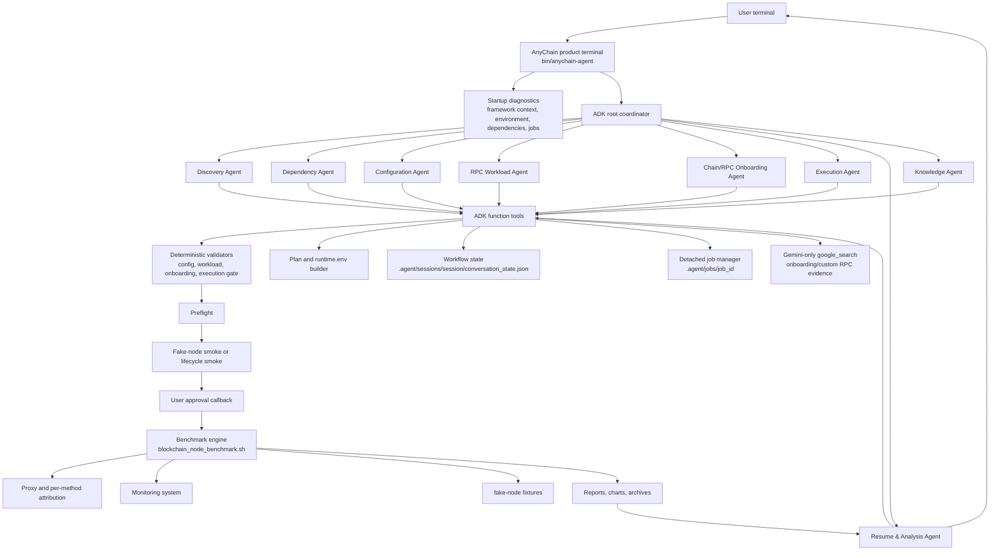
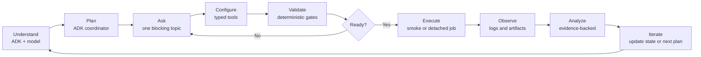
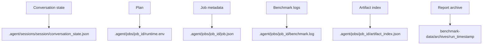

# AnyChain ADK Agent Architecture

AnyChain Agent is a Google ADK-based domain agent that controls the
blockchain-node-benchmark engine. ADK owns reasoning and delegation. The
benchmark framework owns deterministic validation, execution, artifacts, and
evidence.

## Architecture Overview



## Agent Loop



The loop prevents the Agent from acting like a keyword bot:

- user intent is interpreted by ADK and the configured model;
- confirmed facts are stored as structured workflow state;
- every execution path passes through deterministic validators;
- the Agent asks for missing information instead of inventing values;
- smoke tests are isolated from final benchmark job artifacts;
- real benchmark jobs require preflight, smoke, and user approval;
- analysis must cite generated evidence paths.

## Accuracy Boundaries

The Agent may infer and suggest values, but it must not silently decide:

- `LEDGER_DEVICE` when multiple disks are plausible;
- whether a separate `ACCOUNTS_DEVICE` exists;
- custom RPC parameter contracts;
- mixed workload weights;
- unsupported chain adapter family;
- real-node endpoint validity before preflight;
- external Prometheus/Grafana scraping behavior.

When uncertain, the Agent must show the available evidence and ask the user to
confirm or provide a value.

## Runtime State And Artifacts



`runtime.env` is the final per-job confirmed configuration. Users should not
edit it manually. If a user changes an earlier answer, ADK must update or revert
workflow state and regenerate downstream runtime artifacts through tools.

## Google Search Boundary

ADK `google_search` is intentionally narrow:

- enabled only for Gemini with Google authentication and an ADK runtime that
  exposes the tool;
- mounted only on the Chain/RPC Onboarding Agent;
- used for unsupported chain and custom RPC research;
- official documentation is preferred;
- search evidence does not replace endpoint tests, fixture recording, template
  validation, or fake-node smoke.

Other model providers must report web research as unavailable unless the
repository explicitly adds and verifies a provider-specific search integration.

## Development Gates

Before changing Agent code, read:

1. `CLAUDE.md`
2. `docs/zh/anychain-agent-ai-work-gate.md`
3. `agent/README.md`

Then run relevant checks:

```bash
python3 -m unittest tests.test_agent_product_terminal tests.test_agent_runtime_contract
python3 tools/check_agent_boundaries.py --root .
python3 agent/cli.py adk-eval
git diff --check
```

For model-facing behavior, run the live matrices in `tests/agent_live/`.
