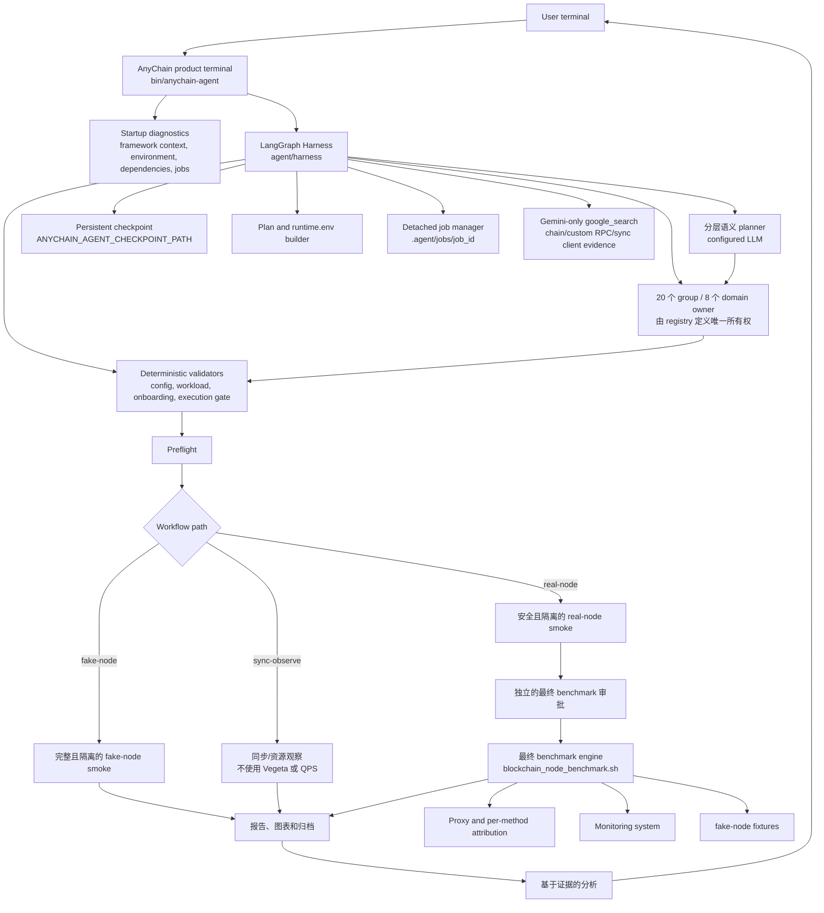
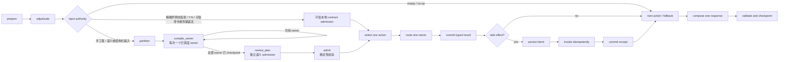
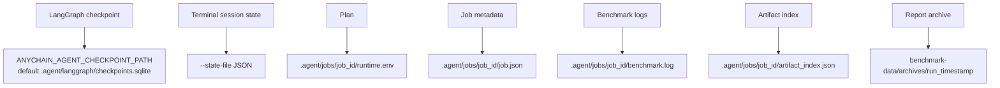

# AnyChain Agent 架构

该文件名仅为保持已有文档链接稳定，并不表示 ADK 拥有 Agent runtime。

AnyChain Agent 是基于 LangGraph Harness 的产品级 Agent，用于控制
blockchain-node-benchmark 引擎。Harness 负责 workflow 状态、group 路由、
fallback 顺序、校验门禁和执行决策。所有模型 provider 都实现同一个
`LLMProvider` contract。OpenAI、DeepSeek 和 Vertex Gemini 使用 OpenAI-compatible
transport；Gemini API key 模式使用原生 `generateContent`，Claude API key 模式使用
Anthropic Messages API，Vertex Claude 使用 `rawPredict`。Google ADK 只用于唯一一项
可选能力——Gemini `google_search` 联网检索
（`agent/llm/search_grounding.py`），以普通函数调用的方式从 Harness 代码里触发。
它绝不能拥有第二套 benchmark wizard、第二套对话循环，也不能绕过 Harness 修改
workflow state。

## 依赖拓扑

runtime 分为两层依赖：

- core：`langgraph`、`langgraph-checkpoint-sqlite`、`openai` 和
  `prompt-toolkit`；该层负责终端和所有已配置 provider，包括 DeepSeek，且不导入
  `google.adk`；
- 可选 search extra：`google-adk`，仅在执行
  `scripts/install_agent_deps.sh --with-google-search` 时安装，只服务于限定范围内的
  Gemini `google_search` 函数。

`requirements-adk.txt`、`.venv-adk` 和 `--adk-venv` 是迁移期 alias，不表示 ADK
拥有 runtime；推荐使用 `--agent-venv`。缺少 Google ADK 只能禁用联网检索，不能阻塞
CLI 启动、provider 认证、plan、validation 或 execution。

## Architecture Overview


```mermaid
flowchart TD
  U["User terminal"] --> T["AnyChain product terminal<br/>bin/anychain-agent"]
  T --> D["Startup diagnostics<br/>framework context, environment, dependencies, jobs"]
  T --> H["LangGraph Harness<br/>agent/harness"]

  H --> I["分层语义 planner<br/>configured LLM"]
  H --> G["20 个 group / 8 个 domain owner<br/>由 registry 定义唯一所有权"]
  H --> S["Persistent checkpoint<br/>ANYCHAIN_AGENT_CHECKPOINT_PATH"]
  H --> VAL["Deterministic validators<br/>config, workload, onboarding, execution gate"]
  H --> PLAN["Plan and runtime.env builder"]
  H --> JOB["Detached job manager<br/>.agent/jobs/job_id"]
  H --> SEARCH["Gemini-only google_search<br/>chain/custom RPC/sync client evidence"]

  I --> G
  G --> VAL

  VAL --> PRE["Preflight"]
  PRE --> MODE{"Workflow path"}
  MODE -->|"fake-node"| FSMOKE["完整且隔离的 fake-node smoke"]
  MODE -->|"real-node"| RSMOKE["安全且隔离的 real-node smoke"]
  RSMOKE --> APPROVE["独立的最终 benchmark 审批"]
  APPROVE --> BENCH["最终 benchmark engine<br/>blockchain_node_benchmark.sh"]
  MODE -->|"sync-observe"| SYNC["同步/资源观察<br/>不使用 Vegeta 或 QPS"]
  FSMOKE --> ART["报告、图表和归档"]
  SYNC --> ART
  BENCH --> PROXY["Proxy and per-method attribution"]
  BENCH --> MON["Monitoring system"]
  BENCH --> FN["fake-node fixtures"]
  BENCH --> ART
  ART --> ANA["基于证据的分析"]
  ANA --> U
```

## Agent Loop


```mermaid
flowchart LR
  A["prepare"] --> B["adjudicate"]
  B --> C{"input authority"}
  C -- "精确声明的选项 / Y-N / 可信命令或传输语法" --> X["可信本地 contract admission"]
  C -- "手工值 / 语义或结构化输入" --> P["partition"]
  P --> O["compile_owner<br/>每次一个已调度 owner"]
  O -- "仍有 owner" --> O
  O -- "全部 owner 已 checkpoint" --> R["review_plan<br/>独立语义 admission"]
  R --> D["admit<br/>确定性校验"]
  X --> E
  D --> E
  C -- "empty / no-op" --> L["fallback"]
  E["select one action"] --> F["route one owner"]
  F --> G["commit typed result"]
  G --> H{"side effect?"}
  H -- "yes" --> I["persist intent"]
  I --> J["invoke idempotently"]
  J --> K["commit receipt"]
  H -- "no" --> L["next action / fallback"]
  K --> L
  L --> M["compose one response"]
  M --> N["validate and checkpoint"]
```

上述生命周期由同一个带 checkpointer 的 compiled graph 执行。框架不存在第二个
不带 checkpoint 的 turn graph，也不存在一次性排空 action queue 的 Python loop。
每次 graph transition 最多选择一个已 admission 的 `ActionEnvelope`；domain owner
只能返回类型化 `HandlerResult`，只有 commit 边界可以修改持久化 domain state。
外部执行必须先持久化 `SideEffectIntent`，再以幂等方式调用，并写入
`SideEffectReceipt`。每一轮还会生成 `TurnReceipt`，绑定 semantic units、admitted
actions、执行顺序、未解析单元和最终问题。

deterministic fast path 的范围必须保持狭窄：只接受当前问题明确声明的
option id/value/label/编号（包括声明的 Y/N）、精确 terminal command、
evidence transport framing 和空输入。用户手工输入的 typed value 不是精确
option；它必须先进入 semantic partition，由模型确定 ownership，然后仍由
pending-question contract 和所属 domain 执行确定性值校验。

`partition`、每一次独立的 `compile_owner`、以及 `review_plan` 都是可
checkpoint 的独立 transition。`review_plan` 对不可变 owner documents 执行独立的
whole-plan semantic admission。其后的 `admit` 是不同的信任边界：在 action
进入 durable queue 前，确定性校验 action schema、provenance、冲突、前置条件、
pending-question contract 和 queue eligibility。

控制平面的职责被明确拆分：

- `admission.py` 在 action 持久化前校验 proposal、冲突、前置条件和 semantic
  coverage；
- `hierarchical_planner.py` 是唯一产品语义规划入口；Stage A 对完整 turn
  分区并分配受限 owner/group route，Stage B 使用 owner-scoped schema 编译
  action，随后执行 whole-plan admission；
- `semantic_admission.py` 在 owner-scoped 编译后准备并校验不可变的 semantic
  document；它不暴露 planner 入口，也不选择 provider；checkpointed
  `review_plan` transition 会为受限的 whole-plan semantic review 提供当前配置的
  provider；
- `advisory.py` 负责链身份、RPC schema 提取和证据分析等 model-backed advisory
  能力；这些能力不能修改状态或选择 graph transition；
- `queue.py` 负责满足依赖的排序和 pending barrier 下的执行资格；
- `routing.py` 负责 navigation prerequisite、return policy 和 canonical fallback；
- `response.py` 是唯一 terminal-response assembler 和 `visible_response`
  writer，每轮最多输出一个可执行 blocking question。domain 和 coordinator
  只能发出已注册的 semantic fragment；`response_catalog.py` 与
  `response_messages/` 是唯一的本地化产品文案权威；
- `coordinator.py` 只实现 graph node transition 和唯一的类型化 commit 边界，
  不解释自然语言、不解析 terminal 输入，也不持有 domain 业务规则。

唯一元数据权威来源是 `agent/workflows/group_registry.py::GROUPS`。它定义
20 个 group 及其字段、问题、依赖、失效关系和 owner。
`agent/harness/state.py::DEFAULT_GROUP_ORDER` 与
`agent/harness/domains/registry.py` 都是派生的 runtime view，不是额外权威来源。

graph 还会把类型化控制 action 路由到 `coordinator` owner。它不拥有任何
`GroupSpec`，也不会增加 domain owner 数量：框架仍然是 20 个 group、8 个
domain owner。

| 顺序 | Group | Owner |
|---:|---|---|
| 1 | `opening` | `orientation` |
| 2 | `target_mode` | `chain_rpc` |
| 3 | `chain_identity` | `chain_rpc` |
| 4 | `provider_deployment` | `environment` |
| 5 | `ledger_disk` | `environment` |
| 6 | `accounts_disk` | `environment` |
| 7 | `network` | `environment` |
| 8 | `endpoint_process` | `chain_rpc` |
| 9 | `chain_auxiliary_endpoints` | `chain_rpc` |
| 10 | `workload_rpc` | `chain_rpc` |
| 11 | `target_samples_fixtures` | `chain_rpc` |
| 12 | `qps_profile` | `performance` |
| 13 | `sync_observe` | `sync_observe` |
| 14 | `observability` | `performance` |
| 15 | `advanced_tuning` | `performance` |
| 16 | `preflight_smoke_execution` | `execution` |
| 17 | `job_monitoring` | `execution` |
| 18 | `failure_recovery` | `recovery` |
| 19 | `error_evidence_analysis` | `analysis` |
| 20 | `report_artifact_analysis` | `analysis` |

这 20 个 group 由 8 个 domain owner 负责。该循环通过以下方式避免 Agent
退化为关键词机器人：

- 配置的模型负责理解用户意图，并返回类型化的 graph action；
- 已确认事实存储为结构化 LangGraph state；
- 用户可以在 group 之间跳转、回退或修改先前答案；
- 被中断的 group 完成后，fallback 到下一个缺失的必需 group；
- 每条执行路径都必须通过确定性 validator；
- Agent 必须询问缺失信息，不能自行编造值；
- smoke 测试与最终 benchmark job 产物相互隔离；
- real-node 最终 benchmark 必须经过 preflight、隔离 smoke 成功和独立最终审批；
  重复审批必须幂等；
- 有副作用的执行由唯一的 `agent/runners/execution_scenarios.py` registry 定义。
  operation 与 workflow 不匹配时必须 fail closed；runtime 不得根据 plan 内容静默
  改写调用方请求的 operation；
- 分析结论必须引用生成的证据路径。

## 准确性边界

Agent 可以推断并建议值，但不得静默决定以下内容：

- 多块磁盘都可能符合条件时的 `LEDGER_DEVICE`；
- 是否存在独立的 `ACCOUNTS_DEVICE`；
- 自定义 RPC 的参数契约；
- mixed workload 权重；
- 未支持链的 adapter family；
- preflight 前 real-node endpoint 是否有效；
- 外部 Prometheus/Grafana 的抓取行为。

存在不确定性时，Agent 必须展示已有证据，并请用户确认或提供值。

## Runtime 状态与产物


```mermaid
flowchart TD
  C["LangGraph checkpoint"] --> S["ANYCHAIN_AGENT_CHECKPOINT_PATH<br/>default .agent/langgraph/checkpoints.sqlite"]
  T["Terminal session state"] --> TS["--state-file JSON"]
  P["Plan"] --> E[".agent/jobs/job_id/runtime.env"]
  J["Job metadata"] --> M[".agent/jobs/job_id/job.json"]
  L["Benchmark logs"] --> LOG[".agent/jobs/job_id/benchmark.log"]
  A["Artifact index"] --> IDX[".agent/jobs/job_id/artifact_index.json"]
  R["Report archive"] --> REP["benchmark-data/archives/run_timestamp"]
```

`runtime.env` 是每个 job 最终确认的配置，用户不应手动编辑。如果用户修改
先前答案，Harness 必须更新或失效受影响的 group state，并通过确定性工具重新
生成下游 runtime 产物。

checkpoint state 当前使用 schema version 18。当前版本的新 turn 绝不调用 legacy
action compiler。version 12 checkpoint 只通过明确的 migration boundary；version 13
会把 deferred queue 保留语义迁移到 typed pending-question contract；version 14
初始化 typed response fragments，并持久化为 version 15；version 16 物化显式的
pending-question owner 与类型化 Chain/RPC case context；version 17 引入可
checkpoint 的 `semantic_planning` contract；version 18 则淘汰持久化的 turn-local
response 文本与 manifest，统一由当前 response authority 负责。迁移到 version 18
时，不会恢复使用旧 contract 编译到一半的 owner cursor 或 response contract，而是
清除不兼容的 in-flight planning/response scratch，同时保留兼容的 durable
workflow state。
更老的 checkpoint 必须进入 quarantine：仅允许列入白名单的环境事实供
用户重新确认，旧 pending action 或通过文件路径猜测出的 plan 绝不能恢复为可执行任务。

## Google Search 边界

ADK `google_search` 的边界必须保持狭窄：

- 仅当 Gemini 配置符合条件、Gemini/Google 认证有效，并且 ADK runtime 暴露该工具时启用
  （`agent/llm/search_grounding.py::web_research_status`）；
- 仅由 chain identity、自定义 RPC schema、sync-observe client setup 三类
  domain path 通过 `run_google_search_grounding` 发起一次性 scoped query，绝不
  运行持久 Agent/Runner 或第二套 conversation loop；
- 用于 unknown chain/protocol、自定义 RPC 和节点客户端资料检索；
- 优先采用官方文档；
- 搜索证据不能替代 endpoint 测试、fixture 录制、template 校验或 fake-node
  smoke。

除非仓库明确新增并验证特定 provider 的搜索集成，否则其他模型 provider 必须将
联网检索报告为不可用。

## 自定义 RPC 契约

自定义 RPC onboarding 必须分别保留 wire facts 和确认语义。零参数 method 使用明确
的空 params；positional 和 object params 必须保留原始 list 顺序或 object key，并逐个
确认 index/name、JSON wire type、区块链 semantic type 或 encoding、meaning、
required/optional 以及 example。request/response sample 只是 evidence，不能替代对
可访问 endpoint 的 probe。

`single_replace` 只选择一个已验证自定义 method；`mixed_replace` 只使用已验证的自定义
methods；`mixed_add` 保留模板默认 methods 并追加自定义 methods。mixed 中每个 active
method 都必须有正整数 weight，且总和严格为 100。所有变化都属于 job-local runtime
override，canonical chain template 保持不可变。fake-node 执行还要求真实 method fixture
和 coverage；real-node 执行仍必须使用最终 `LOCAL_RPC_URL`。

## 历史问题文档卫生

已退役的日期型 repair plan 和 known-issues register 不是架构依据。
`tests/agent_live/legacy_issue_map.py` 将其中仍有效的条目映射到当前 20 个
group、owner、测试证据和 disposition。证据缺失、过时、仅人工验证、间接验证，
或已经不再断言同一行为的条目必须保持 `open`。

## Sync-Observe 边界

`sync-observe` 是节点同步/资源观察的一等 workflow，不属于 RPC workload 路径。
当用户希望观察节点追高速度、MGas/s、节点进程 CPU/线程热点、磁盘 latency/iowait
或网络行为，并且不希望发送 benchmark RPC 流量时，Harness 应该路由到
sync-observe workflow。

该 workflow 需要确认：

- chain 和 sync-health/reference 行为；
- 资源元数据，包括磁盘和网络 baseline；
- 用于 CPU/线程归因的节点进程身份；
- 可选的 `NODE_PROMETHEUS_METRICS_URL`，用于 MGas/s 或客户端原生 execution
  metrics；
- 停止条件：用户停止、固定 duration，或 until synced。

除非用户明确切换回 RPC benchmark，否则该 workflow 不应询问 RPC mode、自定义 RPC
workload、mixed weights、Vegeta 或 QPS profile。

产品执行证据按 execution scenario 计数，不能只按用户可见的审批 action 计数。
必需场景包括独立 fake-node smoke、隔离 RPC real-node smoke、最终 RPC real-node
benchmark 和 bounded sync-observe。这四个 job 必须来自三份不同的 approved plan，
fake-node 证据不能冒充 real-node 证据。bounded sync-observe 证据必须包含真实观测的
performance/sync CSV、中英文 HTML 报告和 sync timeline 图，且不得包含 Vegeta 或
proxy workload 产物。

## 开发门禁

修改 Agent 代码前，必须阅读：

1. `AI_CODING_GUIDE.md`
2. `AGENTS.md`
3. `docs/zh/anychain-agent-ai-work-gate.md`
4. `agent/README.md`

随后运行相关检查：

```bash
python3 -m unittest \
  tests.test_agent_product_terminal \
  tests.test_agent_runtime_contract \
  tests.test_agent_langgraph_harness \
  tests.test_agent_harness_architecture \
  tests.test_agent_response_authority
python3 tools/check_agent_boundaries.py --root .
git diff --check
```

对模型交互行为，必须运行当前产品 Harness。底层 live/PTY 脚本只能作为 provider
driver 或开发辅助，不能替代真实 CLI 场景和确定性断言。

`tests/agent_live/run_product_acceptance.py` 是 Phase 8 evidence-admission
controller，不是 user simulator 或 real-execution provider。它生成 revision-bound
obligation catalog，并接纳 subordinate provider 生成的 evidence。Phase 8 已经实现，
但在 retained real-CLI regression、response-driven 双 AI Chaos、全部必需 real
execution 和最终 product review 分别生成合格证据前，G3-G6 仍未关闭。

固定 CLI matrix 不足以作为产品验收。按照 `tests/agent_live/README.md` 执行：
DeepSeek 运行真实 Docker/Linux CLI，Codex 必须读取上一轮实际回复后再决定下一条用户
输入。生成的 schedule、row、tuple、PTY 返回文本以及 host-only run 都不是已执行
coverage。pass 必须绑定当前 revision 的 observed state transition 和独立验证的
postcondition；execution edge 还必须包含 hash 绑定的 job artifact。registry edge、
高风险多边序列、covering rows、真实执行 artifact 和规定的新 no-S1/S2 动态轮次，必须
分别报告 `observed-pass`、`observed-fail`、`not-run` 和 `externally-blocked`
denominator。fake-node 只能证明
自身闭环，不能证明 real-node 或 sync-observe workflow coverage。没有可用认证时，真实
Gemini `google_search` 必须明确记录为外部验证边界。
