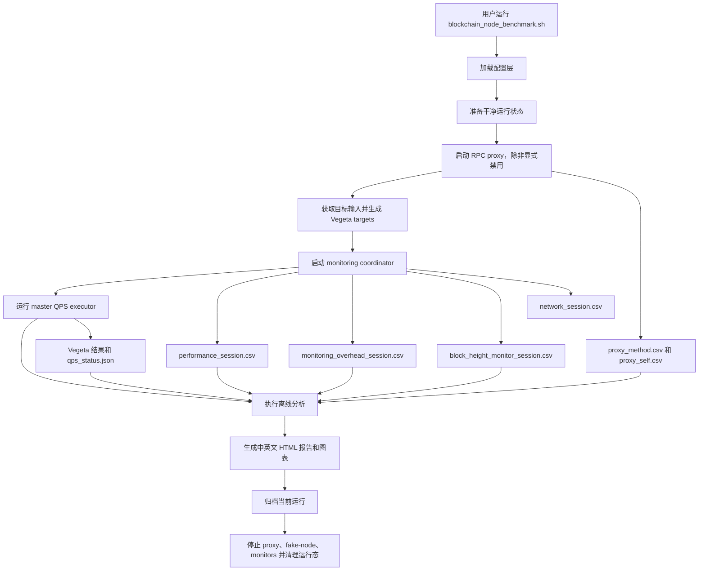
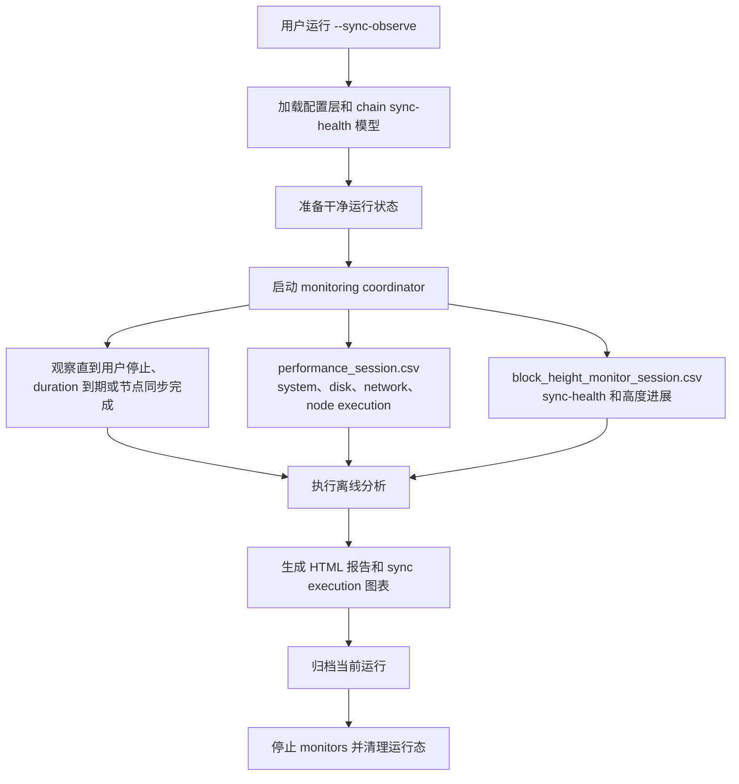
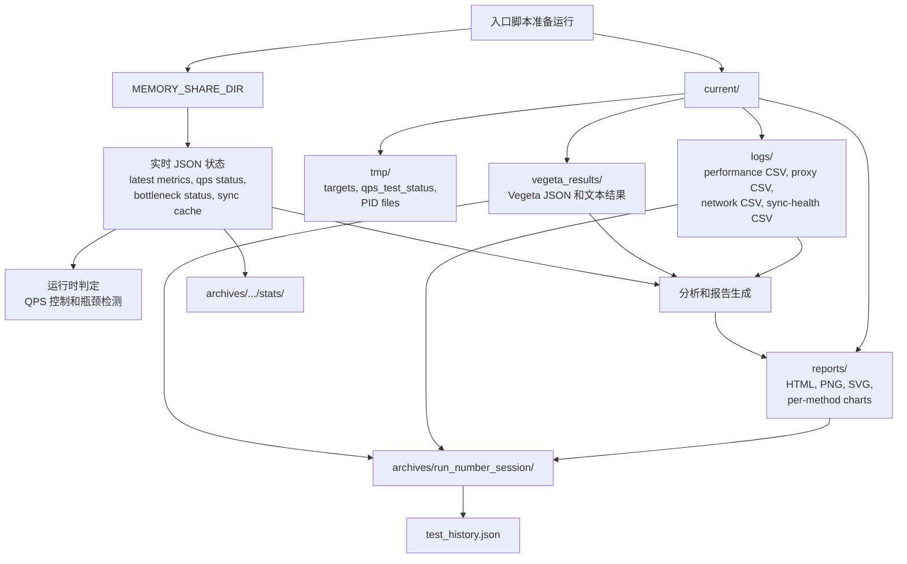
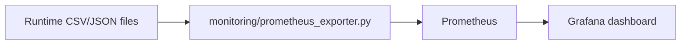

# 框架流程与数据生命周期

[中文](framework-flow.md) | [English](../en/framework-flow.md)

本文档描述 AnyChain Benchmark Agent 当前维护中的端到端运行路径：从入口脚本、
RPC workload 生成、监控采集，到 HTML 报告、归档和可选 Prometheus/Grafana
数据流。

普通的 `--quick`、`--standard`、`--intensive` 是 RPC benchmark 流程。
`--sync-observe` 是独立的同步观察流程：它观察节点追高/同步和资源行为，
不生成 RPC 压测流量、不走 RPC proxy、不生成 Vegeta targets，也不执行 QPS ramp。
它也不要求 `vegeta_results` 产物作为报告成功条件；报告来自 monitoring、
sync-health、node execution、disk、CPU 和 network 数据。

关键入口：

- `blockchain_node_benchmark.sh`
- `config/config_loader.sh`
- `core/master_qps_executor.sh`
- `monitoring/monitoring_coordinator.sh`
- `monitoring/unified_monitor.sh`
- `monitoring/block_height_monitor.sh`
- `tools/target_generator.sh`
- `analysis/*.py`
- `visualization/report_generator.py`
- `tools/benchmark_archiver.sh`
- `monitoring/prometheus_exporter.py`

## 高层运行流程



框架以文件契约为核心。collector 写入带时间戳的 CSV/JSON，analysis 和 report
按路径消费这些文件，而不是直接调用 collector。

## Sync-Observe 运行流程

`--sync-observe` 用于观察节点追高速度、客户端 metrics 暴露时的 MGas/s、
节点进程 CPU/线程热点、磁盘 latency/iowait 背景和网络行为。它复用 monitoring、
analysis、report 和 archive，但会有意跳过 RPC workload 路径。



该路径需要确认 chain/sync-health 行为、资源元数据、节点进程身份和停止条件。
`NODE_PROMETHEUS_METRICS_URL` 是可选项；如果客户端没有暴露 MGas/s 或 gas-used
指标，报告会展示 `execution_metric_status=unavailable`。只有当
`execution_metric_status=available` 且 `execution_metric_source` 明确指出客户端
指标时，数值 0 才表示真实观测值；否则不得把 0 解释为真实吞吐。框架支持 Geth 的
`chain_mgasps` summary。

当 `BLOCKCHAIN_NODE=bsc` 时，BSC v1.7.x profile 会从同一个 endpoint 精确读取
`chain_mgasps{quantile="0.5"}`、`chain_inserts`、`chain_insert_txsize`、
`chain_insert_gasused` 以及 imported/justified/finalized head gauges。报告会增加
区块导入 P50、MGas/s、finality 落后 P50/P90/P99、交易总数、每区块/每秒 Gas、
每交易 Gas、每区块交易数、TPS、CPU、内存和样本质量。这些 BSC 指标不会自动套用
到其他 EVM client；当 scrape interval 跳过已导入区块时，累计交易和 Gas 会明确标记
为估算并展示覆盖率。

Sync-observe 不录制 fake-node fixtures。节点可能先下载 peer snapshot，然后从
snapshot 高度继续追块；框架通过 endpoint/sync-health 真实性校验观察这个行为，
而不是录制 RPC request/response fixtures。

## 文件契约与生命周期



`current/` 属于当前运行，是可丢弃目录。`MEMORY_SHARE_DIR` 存放运行时决策使用
的实时状态，启动和归档后可能被清理。`archives/` 是持久输出边界，保存报告、
日志、Vegeta 结果、选定运行态和 run summary。

## 关键阶段

1. `config/config_loader.sh` 加载 `config/user_config.sh`、provider disk 配置、
   internal/system 默认值、runtime path、deployment mode 和选定 chain template。
2. `prepare_clean_runtime_state` 清理上次运行残留的 symlink、proxy CSV、PID、
   block-height cache、bottleneck 状态和 lock/flag 文件。
3. `tools/fetch_active_accounts.py` 和 `tools/target_generator.sh` 准备 single 或
   weighted mixed Vegeta target。
4. RPC traffic 默认经过 proxy，proxy 写入 `proxy_method.csv` 和 `proxy_self.csv`。
5. `monitoring/monitoring_coordinator.sh` 启动 unified monitor、network monitor、
   block-height/sync-health monitor、cgroup collector 和 disk bottleneck detector。
6. `core/master_qps_executor.sh` 执行 QPS ramp，并写入 Vegeta 结果和 QPS 状态。
7. analysis 和 visualization 消费 CSV/JSON，生成图表和中英文 HTML。
8. `tools/benchmark_archiver.sh` 将 `current/` 移动到 `archives/run_*`，并写入
   `test_summary.json` 和 `test_history.json`。

## 可选 Prometheus/Grafana 流程

Prometheus/Grafana 默认关闭。启用后，exporter 只读取已有运行产物，不查询区块链
RPC，也不写 benchmark 状态。它会读取 runtime JSON、`performance_latest.csv`
和 `proxy_method.csv`；在 sync-observe 模式下，会暴露 MGas/s（如果节点
metrics 提供）、execution metric source/status、节点进程 CPU、热点线程/核心
CPU、CPU iowait 和区块高度字段。



使用：

```bash
OBSERVABILITY_STACK_ENABLED=true deploy/observability/start.sh
deploy/observability/stop.sh
```

HTML 归档报告仍然是持久 benchmark 产物；Prometheus/Grafana 主要用于运行期间
观察实时状态。
